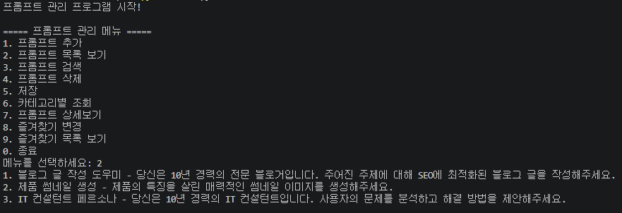
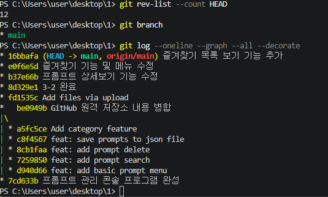
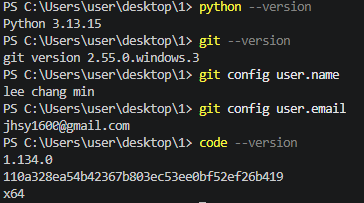

# 프롬프트 관리 프로그램

## 1. 프로젝트 소개

이 프로젝트는 Python으로 만든 콘솔 기반 프롬프트 관리 프로그램입니다.

사용자는 자주 사용하는 프롬프트를 추가하고, 목록으로 확인하며, 검색하거나 삭제할 수 있습니다.  
또한 카테고리별 조회, 상세보기, 즐겨찾기 기능을 통해 프롬프트를 편리하게 관리할 수 있습니다.

---

## 2. 개발 환경

- 운영체제: Windows
- 개발 도구: Visual Studio Code 1.134.0
- 사용 언어: Python 3.13.15
- 버전 관리: Git 2.55.0.windows.3 / GitHub
- 기본 브랜치: main
---

## 3. 기본 데이터

프로그램에는 `prompts.json` 파일을 통해 기본 프롬프트가 3개 이상 등록되어 있습니다.  
프로그램 실행 시 해당 데이터를 불러와 목록에서 확인할 수 있습니다.

기본 프롬프트 예시:
- 블로그 글 작성 도우미
- 파이썬 코드 설명 도우미
- 영어 번역 도우미

---

## 4. 주요 기능

- **프롬프트 추가**  
  제목, 내용, 카테고리를 입력하여 새로운 프롬프트를 저장합니다.

- **프롬프트 목록 보기**  
  저장된 프롬프트의 번호, 제목, 카테고리, 즐겨찾기 여부를 목록으로 확인합니다.

- **프롬프트 검색**  
  입력한 키워드가 포함된 프롬프트를 검색합니다.

- **프롬프트 삭제**  
  번호를 입력하여 원하는 프롬프트를 삭제합니다.

- **JSON 파일 저장 및 불러오기**  
  프롬프트 데이터를 JSON 파일로 저장하고, 프로그램 실행 시 다시 불러옵니다.

- **카테고리별 조회**  
  특정 카테고리에 해당하는 프롬프트만 모아서 확인합니다.

- **프롬프트 상세보기**  
  선택한 프롬프트의 제목, 내용, 카테고리, 즐겨찾기 여부를 자세히 확인합니다.

- **즐겨찾기 추가 및 해제**  
  자주 사용하는 프롬프트를 즐겨찾기로 등록하거나 해제합니다.

- **즐겨찾기 목록 보기**  
  즐겨찾기로 등록된 프롬프트만 따로 확인합니다.

- **잘못된 메뉴 번호 입력 처리**  
  메뉴에 없는 번호를 입력하면 `잘못된 메뉴입니다.`라는 안내 메시지를 출력합니다.
---

## 5. 실행 방법

```bash

GitHub 저장소를 다운로드하거나 clone 합니다.
git clone https://github.com/jhsyi1600/prompt-manager.git

프로젝트 폴더로 이동합니다.
cd prompt-manager

아래 명령어로 프로그램을 실행합니다.
python main.py
```
---

## 6. 실행 화면

### 1) 프로그램 메인 메뉴 및 프롬프트 목록 보기

프로그램을 실행하면 프롬프트 관리 메뉴가 출력됩니다.  
메뉴 번호를 입력하여 프롬프트 추가, 목록 보기, 검색, 삭제, 저장, 카테고리별 조회, 상세보기, 즐겨찾기 기능을 사용할 수 있습니다.

아래 화면은 `프롬프트 목록 보기` 기능을 실행한 예시입니다.



---

### 2) Git 커밋 기록

프로젝트 진행 과정은 Git을 사용하여 기록했습니다.  
기본 기능 구현부터 JSON 저장, 카테고리 기능, 상세보기, 즐겨찾기 기능까지 단계별로 커밋을 남겼습니다.

아래 화면은 `git log --oneline --graph --all --decorate` 명령어로 확인한 커밋 기록입니다.



---

### 3) 개발 환경 확인

프로젝트 개발에 사용한 Python, Git, VS Code 버전을 확인한 화면입니다.



---

## 7. GitHub 저장소

프로젝트 코드는 아래 GitHub 저장소에서 확인할 수 있습니다.

[GitHub 저장소 바로가기](https://github.com/jhsyi1600/prompt-manager)
